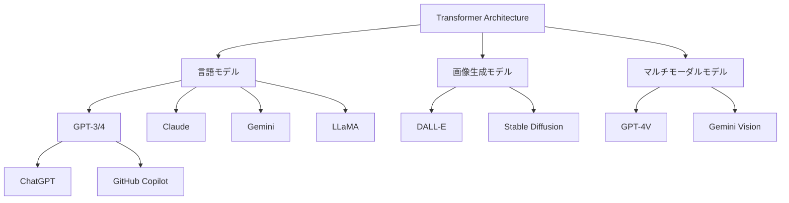

# なぜTransformerが重要なのか

## はじめに：プログラマーの世界を変えた技術

2022年11月30日、OpenAIがChatGPTを公開した日を覚えていますか？その日から、私たちプログラマーの仕事は大きく変わり始めました。コードの自動生成、バグの検出、リファクタリングの提案、そして複雑な技術的質問への即座の回答。これらすべての背後にある技術が、**Transformer**です。

しかし、Transformerは単なる「便利なツール」を生み出しただけではありません。それは、コンピュータが「言語」を理解する方法に革命をもたらした、根本的に新しいアーキテクチャなのです。

この章では、なぜTransformerがこれほどまでに重要なのか、そしてプログラミング言語実装の経験を持つあなたにとって、なぜこの技術を理解することが重要なのかを探っていきます。

## 1.1 現代AIの革命：ChatGPTとその仲間たち

### プログラマーの日常を変えたAIツール

まず、具体的な例から始めましょう。以下は、GitHub Copilotが実際にどのようにコードを補完するかの例です：

```python
# プログラマーが書いたコメント
# フィボナッチ数列を計算する関数を実装

# Copilotが生成したコード
def fibonacci(n):
    """
    n番目のフィボナッチ数を返す
    
    Args:
        n: 求めたいフィボナッチ数の位置（0以上の整数）
    
    Returns:
        n番目のフィボナッチ数
    """
    if n <= 0:
        return 0
    elif n == 1:
        return 1
    else:
        # メモ化を使った効率的な実装
        fib_cache = {0: 0, 1: 1}
        for i in range(2, n + 1):
            fib_cache[i] = fib_cache[i-1] + fib_cache[i-2]
        return fib_cache[n]
```

驚くべきことに、Copilotは単に「フィボナッチ数列」という言葉から、以下を理解しています：

1. **アルゴリズムの選択**: 単純な再帰ではなく、効率的な動的計画法を選択
2. **エラーハンドリング**: `n <= 0` のケースを適切に処理
3. **ドキュメンテーション**: 適切なdocstringを生成
4. **最適化**: メモ化による効率化を実装

これはどのようにして可能になったのでしょうか？

### Transformerが支える技術スタック

現在のAI革命を支える主要な技術を整理してみましょう：



これらすべてのモデルの基盤となっているのが、2017年に発表された論文「Attention is All You Need」で提案されたTransformerアーキテクチャです。

### 実際の影響：開発現場での変化

プログラミングの現場で、Transformerベースのツールがもたらした変化を具体的に見てみましょう：

```python
# 従来の開発フロー
def traditional_development():
    """
    1. 要件を理解する
    2. アルゴリズムを考える
    3. コードを書く
    4. デバッグする
    5. ドキュメントを書く
    6. テストを書く
    7. コードレビューを受ける
    """
    pass

# AI支援による新しい開発フロー
def ai_assisted_development():
    """
    1. 要件をAIと一緒に整理する
    2. AIがアルゴリズムの候補を提案
    3. AIと協力してコードを書く
    4. AIがバグの可能性を指摘
    5. AIがドキュメントの下書きを生成
    6. AIがテストケースを提案
    7. AIが潜在的な問題点を事前に指摘
    """
    # 実際の使用例
    prompt = """
    ユーザー入力を検証する関数を実装してください。
    - メールアドレスの形式をチェック
    - SQLインジェクション対策
    - XSS対策
    """
    
    # AIが生成するコード
    import re
    from html import escape
    
    def validate_user_input(email: str, comment: str) -> tuple[bool, str]:
        """
        ユーザー入力を検証し、安全性を確保する
        
        Returns:
            (is_valid, error_message)
        """
        # メールアドレスの検証
        email_pattern = r'^[a-zA-Z0-9._%+-]+@[a-zA-Z0-9.-]+\.[a-zA-Z]{2,}$'
        if not re.match(email_pattern, email):
            return False, "無効なメールアドレス形式です"
        
        # SQLインジェクション対策：危険な文字のチェック
        dangerous_patterns = [
            r"(\b(SELECT|INSERT|UPDATE|DELETE|DROP|UNION|ALTER)\b)",
            r"(--|#|/\*|\*/)",
            r"(;|\||&&)"
        ]
        
        for pattern in dangerous_patterns:
            if re.search(pattern, comment, re.IGNORECASE):
                return False, "不正な文字が含まれています"
        
        # XSS対策：HTMLエスケープ
        safe_comment = escape(comment)
        
        return True, ""
```

このコードは、セキュリティの専門知識を含む複雑な要件を理解し、適切な実装を提供しています。

## 1.2 歴史的背景：なぜTransformerが生まれたか

### RNNの時代とその限界

Transformerが登場する前、自然言語処理の主流はRNN（Recurrent Neural Network）でした。プログラミング言語の処理に例えると、RNNは次のような問題を抱えていました：

```python
# RNNの処理イメージ（疑似コード）
class RNNCompiler:
    def parse_code(self, source_code):
        tokens = self.tokenize(source_code)
        hidden_state = self.initial_state()
        
        # 問題1: 逐次処理しかできない
        for token in tokens:
            hidden_state = self.process_token(token, hidden_state)
            # 前のトークンの処理が終わるまで次に進めない！
        
        return hidden_state
    
    def process_token(self, token, prev_state):
        # 問題2: 長い依存関係を保持できない
        if len(self.context) > 100:
            # 古い情報が失われていく（勾配消失）
            self.context = self.truncate(self.context)
        
        return self.rnn_cell(token, prev_state)
```

これは、長いプログラムを解析する際に、ファイルの最初で定義された変数を、ファイルの最後で参照できないようなものです。

### RNNの問題を図解

```python
import matplotlib.pyplot as plt
import numpy as np

def visualize_rnn_problems():
    fig, (ax1, ax2) = plt.subplots(2, 1, figsize=(12, 8))
    
    # 問題1: 逐次処理の可視化
    sequence_length = 10
    time_steps = range(sequence_length)
    
    # RNNの処理時間（累積）
    rnn_time = np.cumsum(np.ones(sequence_length))
    # Transformerの処理時間（並列）
    transformer_time = np.ones(sequence_length)
    
    ax1.plot(time_steps, rnn_time, 'r-', linewidth=2, label='RNN（逐次処理）')
    ax1.plot(time_steps, transformer_time, 'b-', linewidth=2, label='Transformer（並列処理）')
    ax1.set_xlabel('シーケンス位置')
    ax1.set_ylabel('処理時間')
    ax1.set_title('RNN vs Transformer: 処理時間の比較')
    ax1.legend()
    ax1.grid(True, alpha=0.3)
    
    # 問題2: 勾配消失の可視化
    distances = range(1, 21)
    # 距離が離れるほど勾配が小さくなる
    rnn_gradient = 0.9 ** np.array(distances)
    # Transformerは距離に関係なく一定
    transformer_gradient = np.ones(len(distances))
    
    ax2.semilogy(distances, rnn_gradient, 'r-', linewidth=2, label='RNN（勾配消失）')
    ax2.semilogy(distances, transformer_gradient, 'b-', linewidth=2, label='Transformer（一定）')
    ax2.set_xlabel('トークン間の距離')
    ax2.set_ylabel('勾配の強さ（対数スケール）')
    ax2.set_title('長距離依存関係の学習能力')
    ax2.legend()
    ax2.grid(True, alpha=0.3)
    
    plt.tight_layout()
    plt.show()

# グラフを表示
visualize_rnn_problems()
```

### LSTMとGRU：部分的な解決策

RNNの問題を解決しようとして、LSTM（Long Short-Term Memory）やGRU（Gated Recurrent Unit）が開発されました：

```python
# LSTMのゲート機構（概念的な実装）
class LSTMCell:
    def __init__(self, input_dim, hidden_dim):
        # 3つのゲート：忘却、入力、出力
        self.forget_gate = self.create_gate(input_dim, hidden_dim)
        self.input_gate = self.create_gate(input_dim, hidden_dim)
        self.output_gate = self.create_gate(input_dim, hidden_dim)
        
    def forward(self, x, prev_hidden, prev_cell):
        # 忘却ゲート：何を忘れるか
        f = sigmoid(self.forget_gate(x, prev_hidden))
        
        # 入力ゲート：何を記憶するか
        i = sigmoid(self.input_gate(x, prev_hidden))
        candidate = tanh(self.candidate_gate(x, prev_hidden))
        
        # セル状態の更新
        cell = f * prev_cell + i * candidate
        
        # 出力ゲート：何を出力するか
        o = sigmoid(self.output_gate(x, prev_hidden))
        hidden = o * tanh(cell)
        
        return hidden, cell
```

しかし、これらも根本的な問題は解決できませんでした：
- **依然として逐次処理**: 並列化できない
- **計算の複雑さ**: ゲート機構による計算コスト増大
- **長距離依存の限界**: 改善はされたが、完全ではない

### Attention is All You Need: パラダイムシフト

2017年、Googleの研究者たちは革命的なアイデアを提案しました：

> 「RNNを完全に排除し、Attention機構だけで言語を処理できるのではないか？」

これは、コンパイラの設計に例えると、次のような発想の転換でした：

```python
# 従来のコンパイラ設計
class TraditionalCompiler:
    def compile(self, source):
        # 段階的に処理（パイプライン）
        tokens = self.lexer(source)          # 字句解析
        ast = self.parser(tokens)            # 構文解析
        typed_ast = self.type_checker(ast)   # 型検査
        ir = self.ir_generator(typed_ast)    # 中間表現生成
        code = self.code_generator(ir)       # コード生成
        return code

# Transformerの発想
class TransformerCompiler:
    def compile(self, source):
        # すべての情報を同時に考慮
        tokens = self.tokenize(source)
        
        # 各トークンが他のすべてのトークンと直接対話
        attention_matrix = self.compute_attention(tokens, tokens)
        
        # 並列処理で一度に解析
        result = self.parallel_process(tokens, attention_matrix)
        return result
```

### Transformerの革新性

Transformerが持つ革新的な特徴を整理すると：

1. **完全な並列処理**
   ```python
   # RNN: O(n) の時間計算量
   for i in range(len(sequence)):
       hidden[i] = f(hidden[i-1], input[i])
   
   # Transformer: O(1) の時間計算量（並列化時）
   attention = compute_all_pairs(sequence, sequence)  # 全ペアを一度に計算
   ```

2. **長距離依存の直接モデリング**
   ```python
   # 任意の距離のトークン間で直接情報交換
   def attention(query_pos, key_pos):
       # 位置に関係なく、関連性があれば高い注意を払う
       return similarity(tokens[query_pos], tokens[key_pos])
   ```

3. **計算効率とスケーラビリティ**
   ```python
   # GPUでの効率的な行列演算
   Q = linear_transform(tokens)  # Query
   K = linear_transform(tokens)  # Key
   V = linear_transform(tokens)  # Value
   
   # 一度の行列演算ですべての注意を計算
   attention_scores = matmul(Q, K.T) / sqrt(d_k)
   attention_weights = softmax(attention_scores)
   output = matmul(attention_weights, V)
   ```

## 1.3 プログラミング言語処理への深い関連

### コード理解・生成への応用

Transformerがプログラミング言語処理に革命をもたらした理由を、具体例で見てみましょう：

```python
# 例：Transformerによるコード補完
class CodeTransformer:
    def __init__(self):
        self.context_window = 2048  # トークン数
        
    def analyze_code_context(self, partial_code):
        """
        コードの文脈を理解し、次に来るべきコードを予測
        """
        # 1. 変数のスコープを理解
        variables = self.extract_variables(partial_code)
        
        # 2. 関数のシグネチャを理解
        functions = self.extract_functions(partial_code)
        
        # 3. インポートされたモジュールを理解
        imports = self.extract_imports(partial_code)
        
        # 4. コーディングスタイルを学習
        style = self.analyze_style(partial_code)
        
        return self.predict_next_tokens(
            partial_code, 
            context={
                'variables': variables,
                'functions': functions,
                'imports': imports,
                'style': style
            }
        )

# 実際の使用例
code_so_far = '''
import numpy as np
import matplotlib.pyplot as plt

def plot_training_history(history):
    """
    訓練履歴をプロットする関数
    """
    fig, (ax1, ax2) = plt.subplots(1, 2, figsize=(12, 4))
    
    # 損失のプロット
    ax1.plot(history['train_loss'], label='Train')
    ax1.plot(history['val_loss'], label='Validation')
    ax1.set_title('Model Loss')
    ax1.set_xlabel('Epoch')
    ax1.set_ylabel('Loss')
    ax1.legend()
    
    # ここで精度をプロットしたい
'''

# Transformerが生成するコード
suggested_code = '''
    # 精度のプロット
    ax2.plot(history['train_acc'], label='Train')
    ax2.plot(history['val_acc'], label='Validation')
    ax2.set_title('Model Accuracy')
    ax2.set_xlabel('Epoch')
    ax2.set_ylabel('Accuracy')
    ax2.legend()
    
    plt.tight_layout()
    plt.show()
'''
```

Transformerは以下を理解しています：
- `ax1`の次は`ax2`を使うべき
- 損失（loss）の次は精度（accuracy）をプロットする慣習
- `plt.tight_layout()`と`plt.show()`で締めくくる
- 一貫したコーディングスタイルを維持

### プログラム解析への応用

```python
# バグ検出の例
def transformer_bug_detector(code):
    """
    Transformerを使ったバグ検出
    """
    # 潜在的なバグパターンを学習済み
    bug_patterns = {
        'null_pointer': 'オブジェクトがNoneの可能性',
        'index_error': 'インデックスが範囲外の可能性',
        'type_error': '型の不一致',
        'resource_leak': 'リソースの解放忘れ',
        'race_condition': '並行処理の競合状態'
    }
    
    # 実際のコード例
    suspicious_code = '''
    def process_data(data_list):
        result = []
        for i in range(len(data_list) + 1):  # バグ: 範囲が1つ多い
            item = data_list[i]
            if item > 0:
                result.append(item * 2)
        return result
    '''
    
    # Transformerの分析結果
    detected_issues = [
        {
            'line': 3,
            'type': 'index_error',
            'message': 'ループの範囲が配列のサイズを超えています。`len(data_list)`を使用してください。',
            'severity': 'high',
            'fix': 'for i in range(len(data_list)):'
        }
    ]
    
    return detected_issues
```

### コンパイラ技術との接点

Transformerの概念は、実はコンパイラ技術と多くの共通点があります：

```python
# シンボルテーブルとAttention機構の類似性
class SymbolTableVsAttention:
    def compiler_symbol_resolution(self):
        """
        コンパイラのシンボル解決
        """
        symbol_table = {
            'global': {'MAX_SIZE': 100, 'DEBUG': True},
            'function_foo': {'x': 'int', 'y': 'string'},
            'function_bar': {'z': 'float'}
        }
        
        # 変数参照の解決
        def resolve(name, scope):
            # 内側のスコープから外側へ探索
            if name in symbol_table[scope]:
                return symbol_table[scope][name]
            elif name in symbol_table['global']:
                return symbol_table['global'][name]
            else:
                raise NameError(f"'{name}' is not defined")
    
    def transformer_attention(self):
        """
        TransformerのAttention機構
        """
        # すべてのトークンが他のすべてのトークンを「見る」
        def attention_mechanism(query_token, all_tokens):
            scores = []
            for key_token in all_tokens:
                # トークン間の関連性を計算
                score = self.compute_relevance(query_token, key_token)
                scores.append(score)
            
            # 関連性の高いトークンに注目
            attention_weights = softmax(scores)
            
            # 重み付き和で情報を集約
            context = sum(weight * token for weight, token in zip(attention_weights, all_tokens))
            return context
```

両者の類似点：
1. **文脈依存の解決**: 変数のスコープ vs トークンの文脈
2. **長距離の参照**: グローバル変数 vs 離れたトークン
3. **階層的な処理**: ネストしたスコープ vs Multi-head Attention

### 最適化技術の共通性

```python
# コンパイラ最適化とモデル最適化の対比
class OptimizationParallels:
    def compiler_optimization(self):
        """
        コンパイラの最適化技術
        """
        # 定数畳み込み
        # Before: x = 2 * 3 * 4
        # After:  x = 24
        
        # ループ展開
        # Before: for i in range(4): sum += arr[i]
        # After:  sum += arr[0] + arr[1] + arr[2] + arr[3]
        
        # デッドコード除去
        # Before: if False: expensive_function()
        # After:  # removed
        
    def transformer_optimization(self):
        """
        Transformerの最適化技術
        """
        # アテンション行列の効率化
        # Flash Attention: O(n²) → O(n)のメモリ使用量
        
        # 量子化
        # 32bit浮動小数点 → 8bit整数
        
        # プルーニング
        # 重要でない接続を削除
        
        # 知識蒸留
        # 大きなモデルから小さなモデルへ知識を転移
```

## 1.4 本書で学ぶこと：理論と実装の融合

### 学習のロードマップ

本書では、以下の順序でTransformerを完全に理解していきます：

```python
class TransformerLearningPath:
    def __init__(self):
        self.chapters = {
            "基礎": {
                "数学": ["線形代数", "確率統計", "微分"],
                "PyTorch": ["テンソル", "自動微分", "NN構築"]
            },
            "コア概念": {
                "Attention": ["内積注意", "スケーリング", "マスキング"],
                "位置エンコーディング": ["絶対位置", "相対位置", "RoPE"],
                "アーキテクチャ": ["エンコーダ", "デコーダ", "接続"]
            },
            "実装": {
                "スクラッチ実装": ["各コンポーネント", "全体統合"],
                "最適化": ["メモリ効率", "計算効率", "並列化"],
                "応用": ["言語モデル", "翻訳", "コード生成"]
            }
        }
    
    def learning_progression(self):
        """
        段階的な学習の進行
        """
        # Phase 1: 理論の理解
        theory = self.understand_mathematics()
        
        # Phase 2: 小さな実装
        components = self.implement_components()
        
        # Phase 3: 統合
        full_model = self.integrate_components(components)
        
        # Phase 4: 応用
        applications = self.build_applications(full_model)
        
        return applications
```

### 実装中心のアプローチ

本書の特徴は、すべての概念を実際に動くコードで説明することです：

```python
# 例：Attention機構の段階的実装
class StepByStepAttention:
    def step1_basic_dot_product(self):
        """
        ステップ1: 基本的な内積注意
        """
        def dot_product_attention(query, key, value):
            # 最もシンプルな形
            score = torch.dot(query, key)
            weight = torch.sigmoid(score)  # 0-1の範囲に
            output = weight * value
            return output
    
    def step2_scaled_attention(self):
        """
        ステップ2: スケーリングを追加
        """
        def scaled_dot_product_attention(query, key, value):
            d_k = key.size(-1)
            score = torch.dot(query, key) / math.sqrt(d_k)
            weight = torch.softmax(score, dim=-1)
            output = weight * value
            return output
    
    def step3_matrix_attention(self):
        """
        ステップ3: 行列演算に拡張
        """
        def matrix_attention(Q, K, V):
            d_k = K.size(-1)
            scores = torch.matmul(Q, K.transpose(-2, -1)) / math.sqrt(d_k)
            weights = torch.softmax(scores, dim=-1)
            output = torch.matmul(weights, V)
            return output, weights
    
    def step4_multi_head(self):
        """
        ステップ4: マルチヘッド化
        """
        class MultiHeadAttention(nn.Module):
            def __init__(self, d_model, n_heads):
                super().__init__()
                self.d_model = d_model
                self.n_heads = n_heads
                self.d_k = d_model // n_heads
                
                self.W_q = nn.Linear(d_model, d_model)
                self.W_k = nn.Linear(d_model, d_model)
                self.W_v = nn.Linear(d_model, d_model)
                self.W_o = nn.Linear(d_model, d_model)
                
            def forward(self, query, key, value, mask=None):
                batch_size = query.size(0)
                
                # 線形変換と形状変更
                Q = self.W_q(query).view(batch_size, -1, self.n_heads, self.d_k).transpose(1, 2)
                K = self.W_k(key).view(batch_size, -1, self.n_heads, self.d_k).transpose(1, 2)
                V = self.W_v(value).view(batch_size, -1, self.n_heads, self.d_k).transpose(1, 2)
                
                # アテンション計算
                scores = torch.matmul(Q, K.transpose(-2, -1)) / math.sqrt(self.d_k)
                
                if mask is not None:
                    scores = scores.masked_fill(mask == 0, -1e9)
                
                weights = torch.softmax(scores, dim=-1)
                context = torch.matmul(weights, V)
                
                # 形状を戻す
                context = context.transpose(1, 2).contiguous().view(
                    batch_size, -1, self.d_model
                )
                
                output = self.W_o(context)
                return output, weights
```

### デバッグとビジュアライゼーション

理解を深めるため、すべての概念を可視化します：

```python
import matplotlib.pyplot as plt
import seaborn as sns

class AttentionVisualizer:
    def visualize_attention_weights(self, text, attention_weights):
        """
        Attention重みの可視化
        """
        tokens = text.split()
        
        plt.figure(figsize=(10, 8))
        sns.heatmap(
            attention_weights,
            xticklabels=tokens,
            yticklabels=tokens,
            cmap='Blues',
            cbar_kws={'label': 'Attention Weight'}
        )
        plt.title('Attention Weights Visualization')
        plt.xlabel('Keys (attended to)')
        plt.ylabel('Queries (attending from)')
        
        # 特定のトークンがどこに注目しているかハイライト
        for i in range(len(tokens)):
            max_attention_idx = attention_weights[i].argmax()
            plt.plot(max_attention_idx + 0.5, i + 0.5, 'r*', markersize=15)
        
        plt.tight_layout()
        plt.show()
    
    def visualize_positional_encoding(self):
        """
        位置エンコーディングの可視化
        """
        d_model = 128
        max_len = 100
        
        pe = torch.zeros(max_len, d_model)
        position = torch.arange(0, max_len).unsqueeze(1).float()
        
        div_term = torch.exp(torch.arange(0, d_model, 2).float() * 
                            -(math.log(10000.0) / d_model))
        
        pe[:, 0::2] = torch.sin(position * div_term)
        pe[:, 1::2] = torch.cos(position * div_term)
        
        plt.figure(figsize=(12, 8))
        plt.imshow(pe.numpy(), aspect='auto', cmap='RdBu')
        plt.colorbar(label='Value')
        plt.xlabel('Dimension')
        plt.ylabel('Position')
        plt.title('Positional Encoding Visualization')
        plt.show()
```

### 応用力の獲得

最終的に、以下のような実用的なスキルが身につきます：

1. **独自タスクへの適用**
   ```python
   # コード要約タスクの実装
   class CodeSummarizer(nn.Module):
       def __init__(self, vocab_size, d_model=512):
           super().__init__()
           self.encoder = TransformerEncoder(vocab_size, d_model)
           self.decoder = TransformerDecoder(vocab_size, d_model)
           
       def forward(self, code_tokens, summary_tokens=None):
           # コードを理解
           code_representation = self.encoder(code_tokens)
           
           # 要約を生成
           if summary_tokens is None:
               # 推論時：要約を自己回帰的に生成
               summary = self.generate_summary(code_representation)
           else:
               # 訓練時：教師あり学習
               summary = self.decoder(summary_tokens, code_representation)
           
           return summary
   ```

2. **ファインチューニングの実践**
   ```python
   # 事前学習済みモデルの特定タスクへの適応
   def finetune_for_bug_detection(pretrained_model, bug_dataset):
       # 最終層を置き換え
       pretrained_model.classifier = nn.Linear(
           pretrained_model.d_model, 
           num_bug_types
       )
       
       # 差分学習率
       optimizer = torch.optim.AdamW([
           {'params': pretrained_model.transformer.parameters(), 'lr': 1e-5},
           {'params': pretrained_model.classifier.parameters(), 'lr': 1e-3}
       ])
       
       # 訓練ループ
       for epoch in range(num_epochs):
           for code, bug_label in bug_dataset:
               loss = train_step(pretrained_model, code, bug_label)
               optimizer.step()
   ```

3. **プロダクション環境での運用**
   ```python
   # 推論の最適化
   class OptimizedInference:
       def __init__(self, model_path):
           self.model = torch.jit.load(model_path)
           self.model.eval()
           
           # KVキャッシュの初期化
           self.kv_cache = {}
           
       @torch.no_grad()
       def generate(self, prompt, max_length=100):
           # バッチ推論の準備
           input_ids = self.tokenizer.encode(prompt)
           
           for _ in range(max_length):
               # KVキャッシュを活用した高速推論
               logits = self.model(input_ids, past_kv=self.kv_cache)
               
               # 次のトークンを予測
               next_token = self.sample(logits[-1])
               input_ids.append(next_token)
               
               if next_token == self.eos_token_id:
                   break
           
           return self.tokenizer.decode(input_ids)
   ```

## まとめ：なぜ今、Transformerを学ぶべきか

Transformerは単なる「流行りの技術」ではありません。それは、コンピュータが言語を理解する方法の根本的な変革であり、今後のソフトウェア開発に不可欠な技術です。

プログラミング言語実装の経験を持つあなたには、Transformerを深く理解するための素晴らしい基礎があります：

- **パターン認識**: 構文解析の経験は、Attentionメカニズムの理解に直結
- **最適化思考**: コンパイラ最適化の知識は、モデル最適化に応用可能
- **システム設計**: 大規模システムの設計経験は、大規模モデルの構築に活用可能

次の章では、これらの知識を活かしながら、Transformerの基礎となる数学的概念を、プログラマーの視点から解説していきます。

---

## 演習問題

1. **概念理解**: RNNとTransformerの並列処理能力の違いを、具体的なコード例で説明してください。

2. **実装課題**: 簡単なAttention機構を実装し、入力文の各単語がどの単語に注目しているかを可視化してください。

3. **応用思考**: あなたが普段使っているプログラミング言語のコンパイラに、Transformerを組み込むとしたら、どの部分に適用すると効果的でしょうか？

4. **調査課題**: 最新のコード生成AI（GitHub Copilot、CodeWhisperer等）を実際に使用し、その長所と短所をまとめてください。

## 参考文献

1. Vaswani, A., et al. (2017). "Attention is All You Need"
2. Devlin, J., et al. (2018). "BERT: Pre-training of Deep Bidirectional Transformers"
3. Brown, T., et al. (2020). "Language Models are Few-Shot Learners"
4. Chen, M., et al. (2021). "Evaluating Large Language Models Trained on Code"

---

次章では、「プログラミング言語処理との類似点」をさらに深く掘り下げ、コンパイラ技術者の視点からTransformerを理解していきます。